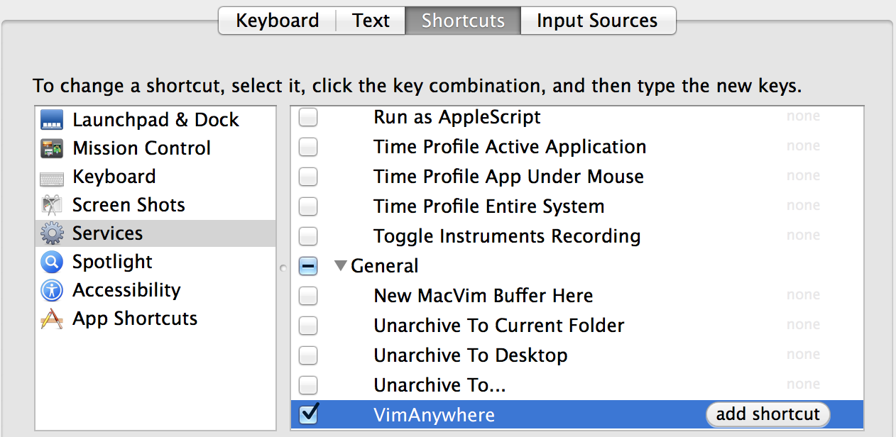

# vim-anywhere

Sometimes, you edit text outside of Vim. These are sad times. It should be
easier to use Vim for more than just code...and now it is!


Once [invoked](#keybinding), vim-anywhere will open a buffer. Close it and it's
contents are copied to your clipboard and your previous application is
refocused.

vim-anywhere currently supports OSX and any Linux distro running Gnome.

## Installation

#### Requirements

__OSX:__

- [Homebrew](http://brew.sh/)
- MacVim: `brew install macvim`

__Linux:__

- Gnome (or a derivative)
- gVim

#### Install

```bash
curl -fsSL https://raw.github.com/cknadler/vim-anywhere/master/install | sh
```

__OSX caveat:__ key binding is unbound by default. See [keybinding](#keybinding)
for details.


#### Update

```bash
~/.vim-anywhere/update
```

#### Uninstall

```bash
~/.vim-anywhere/uninstall
```

## Keybinding

__OSX:__ ( default = unbound, suggested = ctrl+cmd+v )

They keyboard shortcut for invoking vim-anywhere is unbound by default on OSX.
The installation script will automatically open
"System Preferences" -> "Keyboard" -> "Shortcuts". Fill in the following:



__Linux:__ ( default = ctrl+alt+v )

```bash
$ gconftool -t str --set /desktop/gnone/keybindings/vim-anywhere/binding <custom binding>
```

## Previous Files

vim-anywhere creates a temporary file in `/tmp/vim-anywhere` when
invoked. These files stick around until you restart your system.

You can list all of your recent files with:

```bash
$ ls /tmp/vim-anywhere
```

Reopen your most recent file:

```bash
$ vim $( ls /tmp/vim-anywhere | sort -r | head -n 1 )
```

## Why?

I use Vim for _almost_ everything. I wish I didn't have to say _almost_. My
usual workflow is to open Vim, write, copy the text out of my current buffer
and paste it into whatever applicaiton I was just using. vim-anywhere attempts
to automate this process as much as possible, reducing the friction of using
Vim to do more than just edit code.

## Roadmap

- &#x2610; Find a way to automate setting vim-anywhere's keyboard shortcut (OSX)
- &#x2612; Add gVim (and Linux) support
- &#x2610; Speed up opening MacVim (disable animations?)

## Contributing

Love vim-anywhere? Hate it? Want to change it completely? Email me or open and
issue and lets talk. Pull requests, suggestions and issues of any kind are
welcome with open arms.

## License

MIT.
